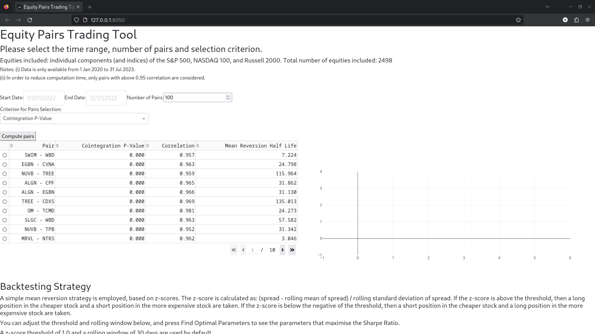
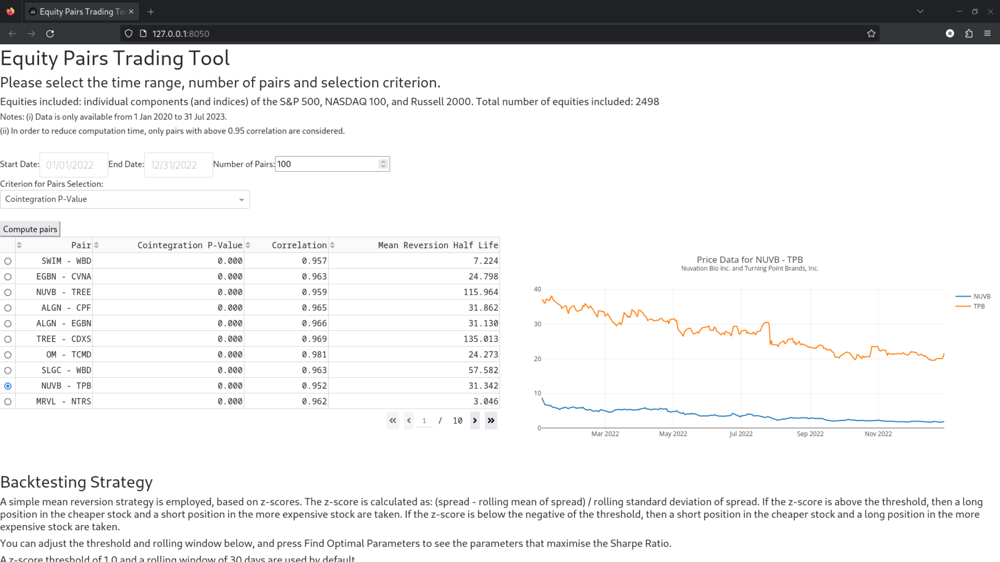
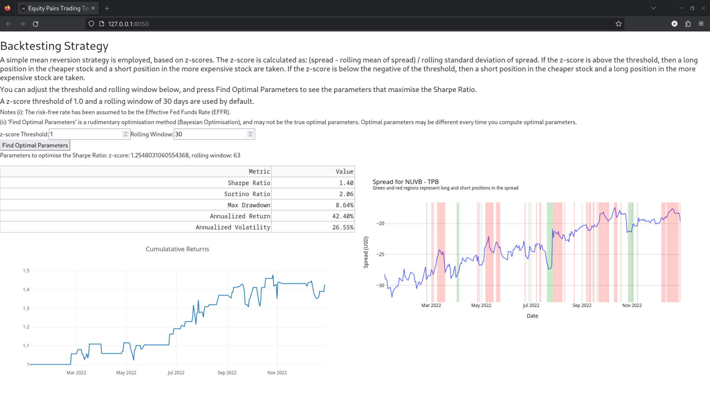

## Requirements

This project has 2 main requirements. Note that this project was developed on Linux (Fedora 38) and has not been tested on Windows/MacOS.

- MongoDB Community Edition (local install)
- Python 3.11

# Installation

## Python environment

Create a virtual environment and install the required packages:

On Linux/MacOS
```bash
cd [root_directory]
git clone https://github.com/rorycreedon/equities_pair_trading_tool
python3 -m venv venv
source venv/bin/activate
pip install -r requirements.txt
```
On Windows
```bash
cd [root_directory]
git clone https://github.com/rorycreedon/equities_pair_trading_tool
python -m venv venv
venv\Scripts\activate.bat
pip install -r requirements.txt
```

## MongoDB
Assuming that MongoDB has been installed locally, run the following command (in the activated virtual environment) to create the database and collections:

```bash
python data_loader.py
```

# Running the GUI

To run the GUI, run the following command in the activated virtual environment:

```bash
python gui/app.py
```

If you see an error stating that the module `database` is not found, then you may need to run the below command to add the current directory to the Python path:

```bash
export PYTHONPATH=$PYTHONPATH:$(pwd)
```

On Windows (this is untested) using Command Prompt:
```bash
set PYTHONPATH=%PYTHONPATH%;%cd%
```
On Windows (this is untested) using PowerShell:
```bash
$env:PYTHONPATH = "$env:PYTHONPATH;$(pwd)"
```

Ctrl + Click on the local address to open the GUI in a browser. The output should contain something similar to the below.

```bash
Dash is running on http://127.0.0.1:8050/
```

When you have finished using the GUI, press Ctrl + C in the terminal to stop the server.

# App Usage
After clicking on the link, you should see the below screen.


Select a start date, end date, the number of pairs that will be displayed and the criterion to select pairs and press Compute pairs. A spinner will appear whilst the pairs are being computed. Once the pairs have been computed, you should see a table similar to the below.



You can click through the table to see more pairs, and sort the table by clicking on the column headers.

Click on the circles next to the pair to show prices and backtest results for the pair.

After clicking on a pair, you should see a graph similar to the below.



You can now scroll down the the backtesting section. You can control two parameters the z-score threshold (default value is 1) and the rolling window (default value is 30). After selecting a pair in the table above, the backtesting section will be automatically updated. There will be a table showing key metrics of the strategy, a graph showing the cumulative returns of the strategy and a graph showing the spread of the pair along with when the strategy was effectively long and short the spread.

You can also click 'Find Optimal Parameters'. This will run a short Bayesian Optimisation algorithm to find the optimal parameters for the strategy. The results will be outputed below the button.




